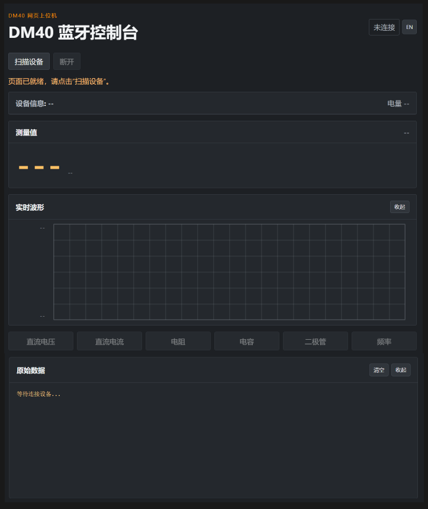
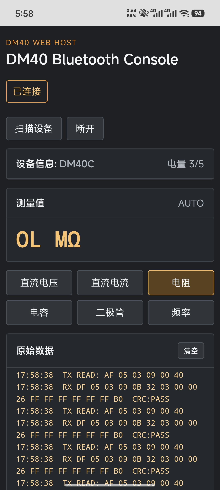

# DM40 Web 上位机

一个基于 Web Bluetooth 的 DM40 系列万用表网页上位机，可以直接在支持 Web Bluetooth 的 Edge 浏览器中连接仪表并查看测量数据。

> 网页版本的代码全部位于根目录，原 Python 项目仅作为协议和功能参考，同时感谢原作者。

## 功能

- 扫描并连接 DM40 系列万用表
- 自动连续读取测量数据
- 支持电压、电流、电阻、电容、二极管、通断、频率和温度等模式
- 网页端切换测量模式，并同步控制万用表
- 显示实时读数、量程、电池电量、充电和 HOLD 状态
- 显示原始 BLE 收发数据和 CRC 检查结果
- 深色界面和 DM40 风格橙色配色

## 在线使用

务必使用支持蓝牙的浏览器，如Microsoft Edge，手机电脑均可使用

网页需要通过以下 HTTPS 地址访问：

```text
https://kuaizhi.github.io/DM40-Html/
```

使用步骤：

1. 打开网页地址。
2. 点击“扫描设备”。
3. 在 Edge 弹出的蓝牙设备选择窗口中选择 DM40 仪表，例如 `DM40A` `DM40B` `DM40C`。
4. 网页会自动连接并开始读取数据。
5. 点击下方模式按键，可以从网页切换万用表的测量模式。

## 使用要求

- 支持 Web Bluetooth 的桌面版或手机版 Edge。
- 系统蓝牙已开启，DM40 仪表处于可连接状态。
- 连接前建议关闭其他正在使用 DM40 的程序。

## 界面截图

 
电脑端示意图(左) 与 手机端示意图（右）


项目结构

```text
  index.html                 网页入口
  app.js                     BLE 连接、轮询和界面交互
  style.css                  页面样式
  protocol/constants.js      DM40 模式和量程定义
  protocol/parser.js         DM40 数据包解析
```

## BLE 接口

```text
服务：0000fff0-0000-1000-8000-00805f9b34fb
通知：0000fff1-0000-1000-8000-00805f9b34fb
写入：0000fff3-0000-1000-8000-00805f9b34fb
```

网页会根据 DM40 协议自动计算命令校验和，并处理仪表返回的测量数据。

## 后续计划

- 完善全部 DM40 量程和特殊测量模式的解析。
- 增加波形显示和 CSV 数据导出。
- 增加 HOLD、Relative 等独立控制。
- 根据设备返回包识别 `DM40A`、`DM40B` 和 `DM40C` 型号。

## 致谢

本网页版本基于原 Python 上位机的 BLE 通信流程和 DM40 协议解析结果重写，感谢原作者 [maj113 (Maj Soklič)](https://github.com/maj113)。
